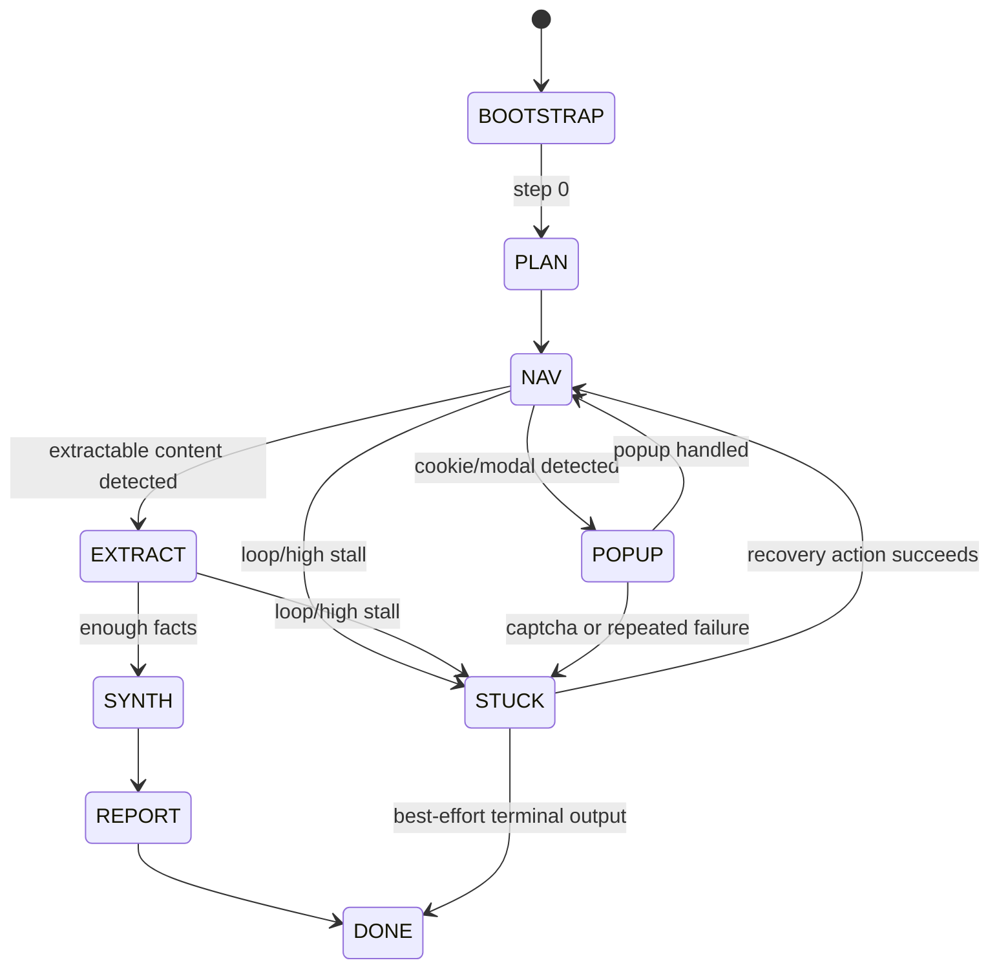

# Operator FSM

This operator now runs a deterministic, observable state machine behind `/act`.

## State Diagram

## Meta-Tools

Internal-only intents (no direct browser side-effect):

- `META.SOLVE_POPUPS`
- `META.REPLAN`
- `META.EXTRACT_LINKS(kind=product_cards|nav_links|all_links)`
- `META.EXTRACT_FACTS(schema=generic|product_page|pricing)`
- `META.SEARCH_TEXT(query)`
- `META.FIND_ELEMENTS(role?, text?, limit?)`
- `META.SELECT_NEXT_TARGET`
- `META.ESCALATE(reason)`
- `META.SET_MODE(mode)`
- `META.MARK_PROGRESS(id,status)`

Internal loop is capped by `MAX_INTERNAL_META_STEPS=3`.

## AgentState Schema

`state_out` (and `state_in`) follows:

- `mode`: `BOOTSTRAP|POPUP|PLAN|NAV|EXTRACT|SYNTH|REPORT|STUCK|DONE`
- `plan`:
  - `subgoals[{id,text,status}]`
  - `active_id`
- `frontier`:
  - `pending_urls[]`
  - `pending_elements[]`
- `visited`:
  - `urls[]`
  - `page_hashes{url:hash}`
- `memory`:
  - `facts[]`
  - `checkpoints[]`
  - `history_summary`
- `counters`:
  - `stall_count`
  - `repeat_action_count`
  - `meta_steps_used`
- `blocklist`:
  - `element_ids[]`
  - `until_step`
- runtime fields for loop tracking:
  - `last_url`
  - `last_dom_hash`
  - `last_action_sig`
  - `last_action_element_id`
  - `escalated_once`

Hard limits are applied in serialization (facts/checkpoints/frontier/visited/string lengths), and HTML is never persisted in state.
